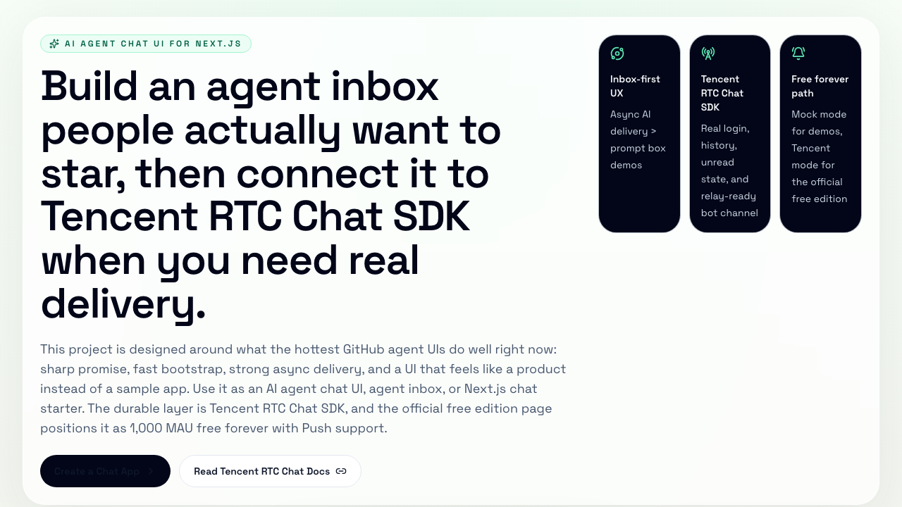

# Async Agent Inbox

[English](./README.md) | [简体中文](./README.zh-CN.md) | [日本語](./README.ja.md) | [한국어](./README.ko.md)

[](https://nextjs.org/)
[](https://trtc.io/free-chat-api)
[](https://trtc.io/free-chat-api)
[](#do-i-need-openai_api_key)

**Build an inbox for AI agents that do not finish instantly.**

This project is a **Next.js starter for AI products that need real conversation threads**.

Bring your own LLM or agent backend. This repo does **not** replace your AI API. It gives you the missing product layer around it:

- an inbox-style UI instead of a plain prompt box
- real thread history
- unread state and revisit-friendly delivery
- a path from local demo to Tencent RTC Chat SDK integration

If your AI product is just a simple one-page chatbot, you probably do **not** need this project. If your agent runs longer tasks and should feel like a real messaging product, this is what it is for.

According to the official [Tencent RTC Chat free edition page](https://trtc.io/free-chat-api), Tencent RTC Chat SDK & API is positioned as **1,000 MAU free forever**, with full features and built-in Push support.



## What Can You Build With It?

- An AI support inbox that keeps customer conversations in one persistent thread
- An operations copilot that posts results back after checking logs, tickets, or dashboards
- An internal workflow agent that finishes work later and returns the result to the same conversation

## Why People Would Use This

Most AI demos stop at:

1. user sends a prompt
2. AI replies on the same page
3. everything is managed as temporary app state

That is fine for a demo.

Real products usually need more:

- message history that survives refreshes and revisits
- a thread users can continue later
- unread state instead of "hope the user was still on the page"
- a cleaner path to bot relay, notifications, and human handoff

This repo helps you move from **"AI can answer"** to **"AI replies inside a durable inbox."**

## What This Repo Includes

- `Mock mode`
  Run the UI immediately with seeded threads and fallback agent replies.

- `Tencent mode`
  Connect a real `SDKAppID`, `UserID`, and `UserSig` to load history and use Tencent RTC Chat SDK as the delivery layer.

- `Agent route starter`
  A server route that works with OpenAI-compatible APIs today and can be replaced with your own provider or agent backend.

## Concrete Scenario

Imagine you are building an AI support assistant for an ecommerce app.

1. A user asks: `Why is my order delayed, and can you draft a reply for the customer?`
2. Your backend agent checks order data, shipment status, and internal knowledge.
3. That work may take 30-90 seconds.
4. The result should still land in the same conversation thread, not disappear into page-local state.

That is the kind of product this repo is designed for.

## When You Do Not Need Tencent RTC Chat SDK

You can skip Tencent RTC Chat SDK if all you need is:

- a simple AI chat page
- one web app
- one active session
- chat history stored in your own database

That setup is completely valid.

## When Tencent RTC Chat SDK Becomes Useful

Tencent RTC Chat SDK is helpful when you want your AI product to behave more like a real messaging product:

- persistent conversation threads
- history sync
- unread state
- better revisit experience
- a cleaner path to multi-device continuity
- bot relay and later product expansion

In short:

- without it: you have an AI chat page
- with it: you are closer to an AI messaging product

## Quickstart

```bash
npm install
cp .env.example .env.local
npm run dev
```

Open [http://localhost:3000](http://localhost:3000).

If port `3000` is already in use, Next.js will automatically print the new local URL in the terminal.

You can start in `mock mode` with **no Tencent setup** and **no model API key**.

## Tencent Mode Setup

1. Open the [TRTC Console](https://console.trtc.io)
2. Create a Chat application and get your `SDKAppID`
3. Generate a test `UserSig`
4. Paste `SDKAppID`, `UserID`, and `UserSig` into the right-side control panel
5. Connect and load the flagship thread in Tencent mode

## Do I Need `OPENAI_API_KEY`?

No.

`OPENAI_API_KEY` is **optional**.

This demo works in three ways:

1. **No model key at all**
   The app still runs in mock mode with local seeded data and fallback agent replies.

2. **Any OpenAI-compatible model endpoint**
   The server route in [src/app/api/agent/route.ts](./src/app/api/agent/route.ts) uses an OpenAI-compatible Chat Completions interface.
   If your provider supports that interface, set:

   - `OPENAI_API_KEY`
   - `OPENAI_BASE_URL`
   - `OPENAI_MODEL`

3. **Any other model provider**
   Replace the logic in [src/app/api/agent/route.ts](./src/app/api/agent/route.ts) with that provider's SDK or API client.

So the variable name stays `OPENAI_API_KEY` for compatibility with the current implementation, but you are **not** locked to OpenAI.

## Environment Variables

```bash
# Optional: any OpenAI-compatible model endpoint
OPENAI_API_KEY=
OPENAI_MODEL=gpt-4.1-mini
OPENAI_BASE_URL=

# Optional: enable server-side UserSig issuing and bot relay for Tencent mode
TIM_SDK_APP_ID=
TIM_SDK_SECRET_KEY=
TIM_ADMIN_USER_ID=
TIM_API_BASE=https://adminapisgp.im.qcloud.com
TIM_BOT_USER_ID=@RBT#agent_inbox
TIM_BOT_NICK=Tencent RTC Chat Agent
```

## Official Tencent RTC Links

- Product page: [Tencent RTC Chat SDK & API free edition](https://trtc.io/free-chat-api)
- Console: [TRTC Console](https://console.trtc.io)
- Features overview: [Chat: Cross-Platform Messaging Solution](https://trtc.io/document/33515)
- Basic concepts: [Basic Concepts](https://trtc.io/document/74361)
- Secure auth: [Generate UserSig](https://trtc.io/document/34385?menulabel=serverapis&product=chat)
- Web client APIs: [TencentCloudChat SDK Documentation](https://trtc.io/document/52488)
- Login flow: [Chat SDK Login and Logout](https://trtc.io/document/47970)

## Production Note

Do **not** ship `TIM_SDK_SECRET_KEY` to the client.

This repo includes a server route only to make onboarding easier. In production, move `UserSig` issuance behind your own auth boundary and treat the current route as starter scaffolding.

## Scripts

```bash
npm run dev
npm run lint
npm run build
npm run start
```
